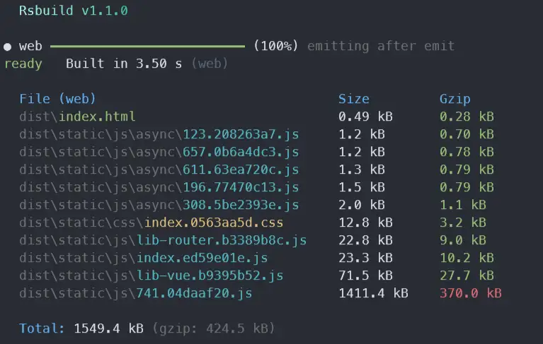

# APP-META 示例
> 构建工具使用 Rsbuild

## H5小程序

### 打包与部署
> 以`h5-demo`为例进行说明

```shell
# 通常使用以下命令即可完成打包
pnpm -F h5-demo build
```



#### 方式一：通过自行压缩并上传

1. 将 `dist` 目录下内容压缩为`zip`
2. 在后台部署页面上传压缩包即可

#### 方式二：通过`meta`命令行工具

```shell
# p 为 page 子命令的缩写
# deploy 意为部署到服务器
# -z 意为自动压缩 dist 目录（后续将上传该压缩包）
# -m 意为描述信息
meta p deploy h5-demo -z -m 更新内容说明
```
